uvicorn app.main:app --reload

http://127.0.0.1:8000/health
http://127.0.0.1:8000/docs

aws configure
aws sts get-caller-identity

## Project Structure Diagram

```mermaid
flowchart TD
	root[order_notification_system]

	root --> readme[README.md]
	root --> app[app/]
	root --> lambda[lambda/]

	app --> app_init[__init__.py]
	app --> app_main[main.py]
	app --> api[api/]
	app --> clients[clients/]
	app --> constants[constants/]
	app --> core[core/]
	app --> dependencies[dependencies/]
	app --> exceptions[exceptions/]
	app --> middleware[middleware/]
	app --> models[models/]
	app --> repositories[repositories/]
	app --> schemas[schemas/]
	app --> services[services/]
	app --> utils[utils/]

	api --> v1[v1/]
	v1 --> router[router.py]
	v1 --> endpoints[endpoints/]
	endpoints --> orders_ep[orders.py]

	clients --> sns_client[sns_client.py]
	clients --> sqs_client[sqs_client.py]

	constants --> event_type[event_type.py]

	core --> config[config.py]
	core --> context[context.py]
	core --> exception_handler[exception_handler.py]
	core --> logger[logger.py]

	dependencies --> services_dep[services.py]

	exceptions --> base_exc[base.py]
	exceptions --> order_exc[order.py]

	middleware --> request_id[request_id.py]

	schemas --> event_schema[event.py]
	schemas --> order_schema[order.py]

	services --> order_service[order_service.py]
	services --> sns_service[sns_service.py]
	services --> sqs_service[sqs_service.py]

	lambda --> layers[layers/]
	lambda --> order_processor[order_processor/]

	layers --> common_layer[common_layer/]
	common_layer --> python_layer[python/]
	python_layer --> requirements[requirements.txt]

	order_processor --> lambda_function[lambda_function.py]
```



```text
order_notification_system/
|- README.md
|- app/
|  |- __init__.py
|  |- main.py
|  |- api/
|  |  |- v1/
|  |  |  |- router.py
|  |  |  |- endpoints/
|  |  |  |  |- orders.py
|  |- clients/
|  |  |- sns_client.py
|  |  |- sqs_client.py
|  |- constants/
|  |  |- event_type.py
|  |- core/
|  |  |- config.py
|  |  |- context.py
|  |  |- exception_handler.py
|  |  |- logger.py
|  |- dependencies/
|  |  |- services.py
|  |- exceptions/
|  |  |- base.py
|  |  |- order.py
|  |- middleware/
|  |  |- request_id.py
|  |- models/
|  |- repositories/
|  |- schemas/
|  |  |- event.py
|  |  |- order.py
|  |- services/
|  |  |- order_service.py
|  |  |- sns_service.py
|  |  |- sqs_service.py
|  |- utils/
|- lambda/
|  |- layers/
|  |  |- common_layer/
|  |  |  |- python/
|  |  |  |  |- requirements.txt
|  |- order_processor/
|  |  |- lambda_function.py
|  |  |- requirements.txt   
```